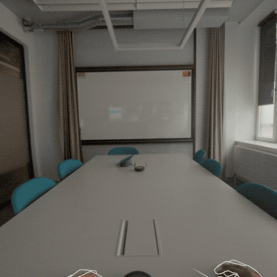

# Android XR Samples for Unity

These simple, yet playful, samples demonstrate Android XR platform features and
show how to implement the experiences. This project uses both the
[Android XR: OpenXR package](https://docs.unity3d.com/Packages/com.unity.xr.androidxr-openxr@1.0/manual/index.html) and [Android XR extensions for Unity](https://github.com/android/android-xr-unity-package).

## Prerequisites

1. Download [Unity 6000.3.14f1](https://unity.com/releases/editor/whats-new/6000.3.14f1)
2. Select “Android Build Support” module
3. Install OpenJDK
4. Install Android SDK & NDK tools

## Getting Started

1. Open the project in Unity
2. Open the Build Profiles menu and switch to the Android platform
3. Open the Window menu and click on TextMeshPro -> Import TMP Essential Resources
4. Build and run the project

The app will show up as Android XR Unity Samples on your device.

For more information see: https://developer.android.com/develop/xr/unity

## Showcase Samples

Explore the fun and interesting possibilities of Android XR through interactive
showcase samples. These samples are integrated into a single Unity project,
to make it convenient to discover, engage with, and learn how to implement these
experiences.

### Home

The app will start in the Home scene which displays the feature dashboard. The
dashboard provides a quick overview of what OpenXR features are working as
expected.

Note: for Eye Tracking and Face Tracking to work, the device needs to be
calibrated using the respective calibration app.

Performing an application gmenu gesture will open the main menu for the app,
which allows switching between various samples listed below, and navigating to
the Settings menu to change various settings:

* The Debug Mode setting is a global setting that will make some samples display
more information about what's happening behind the scenes.
* The Hand Mesh setting switches between using the Hand Mesh OpenXR extension or
default hand models.

### Paint Splash

Throw paint balls which splash on collision with the world.

**How to use**

Pinch with left or right hands to spawn pain balls from the hands. Aim at real
world environment to see them pop and leave a splash of paint.

**How it works**

The Scene Mesh is used for physics collisions and occlusions. Unity's object
pool is used to manage the balls. Each paintball has a collider which is used to
detect collisions with the Scene Mesh. Upon colliding with the environment, a
decal is placed to mark the spot.

### Sea Through

See what the real world would like if it were suddenly submerged under water!

**How to use**

Open the sample and look around. The room will be slowly filled with water and
fish appear around. Try interacting with the fish.

**How it works**

This sample creates screen-space effects using the Depth Texture. It is used to
create a point cloud to roughly approximate the real-world to compensate for
delays when moving around. Screen-space effects are created in a post-processing
step in the render pipeline using custom shader graphs.
Depth-based effects include occlusions, underwater fog, and water caustics.

### Tape Measure

Measure real world distances using environment meshes.

**How to use**

Use the right hand to point at a point in the real world, and pinch and drag to
measure the distance to another point. Releasing the pinch finalizes the
measurement.

**How it works**

The Scene Mesh is used to approximate the real world. It can be seen by enabling
Debug Mode in the Settings Menu of the app. Pinching casts a ray from the right
hand onto the Scene Mesh to find intersections and measure distances.

### Tabletop Mess

This sample uses plane tracking to visualize planes around the user
which allows them to drop visual items onto them.

**How to use**

The device detects and visualizes nearby planes. Use hand rays to aim at object
icons in the UI and pinch to spawn interactive 3D objects on the virtual planes.
Manipulate objects by picking them up and move them with hand rays.
Tapping the UI button will toggle passthrough cutouts for the planes.

**How it works**

The AR Plane Manager spawns a new instance of the Plane prefab for each detected
plane. The prefab uses a Mesh Collider to handle collisions with the spawned
objects.

### Screen Wiper

Aim and pinch to scrub away your virtual environment to reveal the real world
behind it. This showcase highlights one way to blend virtual worlds with the
real world by allowing the user to modify a virtual mask.

**How to use**

Each hand controls a cursor. Pinch to activate a hand’s respective cursor to scrub
away the virtual environment at that position. Stop pinching with both hands to
reset the environment.

**How it works**

This sample renders a mask texture to the screen to cover over passthrough. Rays
are cast from the hands onto the mask to find collisions and mark pixels the
corresponding pixels as transparent, which will allow passthrough to appear from
under them.

### Device Detector

Create interactable balloons from your bluetooth connected keyboard. The object
tracking feature identifies a real keyboard on your desk. When identified,
key presses generate playful balloons.

**How to use**

Connect a bluetooth keyboard to your headset, each typed key will appear
above the keyboard.

**How it works**

The AR Tracked Object Manager instantiates the TrackedObject prefab each time it
detects a keyboard. The prefab instance listens for keyboard events and spawn an
object for each key press.

### Gaze and Pinch

Use Eye Tracking and Pinch gestures to fire projectiles at virtual structures.

**How to use**

The experience consists of two phases: Setup and Playing

During the setup phase, the system uses plane tracking to detect suitable planes
in the user's environment. Looking around will highlight detected planes and
indicate their suitability.

The user initiates the playing phase by selecting a plane using a pinch gesture
with either hand.

In the playing phase, a virtual structure with three projectile launchers
appears. Looking at a launcher activates it, and a pinch gesture launches
a projectile at the structure.

Looking at the virtual structure also displays a user interface on top of it.
This UI can be interacted with using eye tracking and pinch to reset the
structure, display a different structure, or return to the setup phase.

**How it works**

Similar to Tabletop Mess, a plane is used as the base playground to place the
structure and launchers. The OpenXR Eye Gaze Interaction profile is used for eye
tracking, and the XR Interactable components on the launchers are configured to
allow gaze interactions.

### Creature Gaze

Friendly creatures that mimic your eye position by using the AR Face API eye
info.

**How it works**

Creature Gaze used the AR Face Manager to get coarse per-eye information to
control the creatures. Each of which mirrors that with a random delay offset.

### Talking Objects

Using the Face Tracking API control various objects with your face! Press the
record button to capture a short clip for endless playback or puppet the objects
in real time. This showcase highlights face tracking for humanoid and
non-humanoid objects.

**How to use**

Face tracking will automatically begin when the scene starts.

* To switch between the Picture Frame Face, Balloon, and Couch, use the arrow
buttons located on the sides of the object.
* Tap the Record button to create a brief video clip.
* Once recording is complete, playback will start automatically.
* To halt any playback, press the Stop button.
* Press the Play button to initiate any recorded playback.

**How it works**

Blend shape weights for the face are read by using the XR Face Tracking Manager
component. The weights are then applied to the Skin Mesh Renderer of an object.

### Marker Maze

Experiment with the AR Marker and QR Code Tracking APIs.

**How to use**

Use the first marker from the sample markers file inside the
`Textures/ARMarkers/` folder. Holding that in from of the device will pop up a
virtual marble game. Moving around the marker controls the game.

**How it works**

The sample uses the AR Tracked Image Manager to detect makers and QR codes and
spawn virtual objects when detected.

### Surface Canvas

Interact with various UI controls in XR through all the supported interaction
modes. Switch between the supported input modes: hand tracking only,
hand + eye tracking, eye tracking only, head + hand tracking, head tracking
only. Toggle passthrough on/off and set the blend level for passthrough.
Enable/disable an aiming reticle during eye and head tracking modes.

**How to use**

Look around and locate the virtual table with the object on top of it and UI
panels floating above it.

**UI Panels:**

* Left & Middle: Control object parameters.
* Right: Switch input modes, toggle passthrough, and adjust passthrough blend.

**Interaction Modes:**

* Eye & Hands: Gaze to select, pinch to activate.
* Hands Only: Point hand raycast, pinch to activate.
* Eye Tracking Only: Gaze to select, dwell for 1 second to activate.

### Gesture Run

Uses the Hand Gestures API in order to control a running ball. Various gestures
are used as the input actions on the ball. Can collect coins or
destroy structures along the path.

**How to use**

Each hand manages the ball on its corresponding lane.

* Pinch: To move a ball to the other lane.
* Open Palm Gesture: To jump.

**How it works**

This sample uses Unity's Input System and binds to actions for pinch and
grasp from the OpenXR Hand Interaction Profile. The actions are used to control
the rolling marble.

### Sound Arena

The user is placed in a room with multiple sound sources and can play through a
scripted experience. Interact with the sound directivity by locating
audio sources in 3D space while everything is dark around you.

**How to use**

Ensure the sound volume is audible (not muted); headphones are recommended for
optimal experience.

* Load the Sound Arena sample.
* Locate the experience guide, identified by floating tutorial text.
* Await the introduction, which begins shortly after the lights dim and a flashlight appears near the guide.
* Pinch with either hand to bring the flashlight to it; a single pinch with a specific hand attaches the flashlight to that hand.
* Using the auditory cues of the moving critter, direct the flashlight at it and maintain focus until it disappears. Repeat this process three more times.
* Once the lights return, you can continue interacting with the sample or exit.

**How it works**

The sample uses 3d sound sources on game objects to provide sound directivity.
Passthrough is dimmed down using a shader which blends the background with a
semi transparent black pixels to create the effect. Another shader is used to
create a flash-light effect by blending the flashlight with fully transparent
pixels to create a cutout.

### Avatar Mirror

Control a set of avatars animated through Android XR's Perception APIs.

**How to use**

The upper body of the avatar will mirror the user's hands, eyes and facial
expressions. The control panel can be used to switch between avatars or look at
it from a different angle.

**How it works**

This sample uses Eye Tracking and Face Tracking APIs to get the user's facial
expressions. The Hands service is used for updating hand positions, and the
Body Tracking APIs for getting avatar bone information.

### Drone

Control a flying drone using controllers or a gamepad around the real world
environment. Try to avoid hitting real world obstacles.

**How to use**

This sample requires XR controllers, d-pad, or game controller paired with
the device. The controller can then be used to control the drone and fly around.
Bumping into the real world will cause the drone to explode.

**How it works**

The app uses controller action bindings through Unity's input system to read
controller input and flyt he drone. The Scene Mesh is used for occlusion, real
world shadows, and collisions.

### Gemini

Use Gemini to generate procedural materials or learn cooking recipes!

**How to use**

Using Gemini requires an API key. Set the `GeminiAPIKey` field in the Gemini
settings asset (`Assets/AndroidXRUnitySamples/Gemini/ScriptableObjects/GeminiAPISettings.asset`)
before building and running the app. Alternatively, the API key can be encoded
inside a QR code and held in front of the user at runtime.

When running the sample, the user can ask questions from Gemini via voice
commands, which sees what the user sees.

**How it works**

This sample comprises of a few java modules used for collecting input data,
communicating with Gemini, and playing back the answer. These modules can be
found inside the sample's `Scrips/Plugins` folder:

* Camera: uses Camera2 APIs to capture forward facing camera images
* SpeechToText: used for capturing user voice commands as a string
* SpeechToText: used for speak Gemini's response as voice
* Gemini: used for calling the Gemini APIs over the Internet while passing
user commands and camera image, and parsing the response

