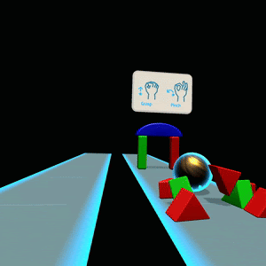
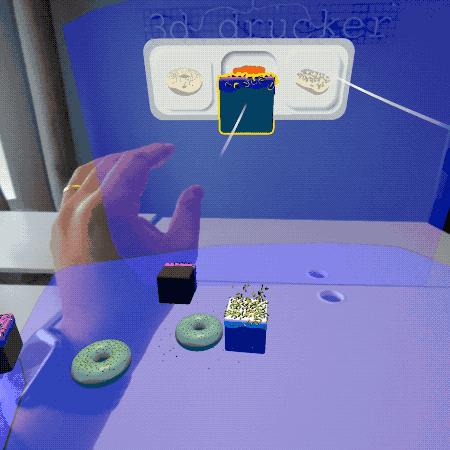

# Android XR Samples for Unity

This repository contains a set of Unity samples to help you learn about building experiences with Unity for Android XR. Each sample demonstrates different use cases, complexity levels and APIs.

##  Requirements
------------

1. Download [Unity 6000.1.0b12](https://unity.com/releases/editor/beta/6000.1.0b12)
2. Select “Android Build Support” module
3. Install OpenJDK
4. Install Android SDK & NDK tools

🧬 Samples
------------

| Project ||
|:-----|-----|
Explore the fun and interesting possibilities of Android XR through interactive showcase samples. These samples are integrated into a single Unity project, to make it convenient to discover, engage with, and learn how to implement these experiences.    <b>Packages used</b>     • [Android XR: OpenXR package](https://docs.unity3d.com/Packages/com.unity.xr.androidxr-openxr@1.0/manual/index.html)   •  [Android XR Extensions for Unity](https://github.com/android/android-xr-unity-package)  •  [OpenXR Plugin](https://docs.unity3d.com/Packages/com.unity.xr.openxr@1.13/manual/index.html)  •   [XR Composition Layers](https://docs.unity3d.com/Packages/com.unity.xr.compositionlayers@1.0/manual/index.html)   •   [XR Hands](https://docs.unity3d.com/Packages/com.unity.xr.hands@1.5/manual/index.html)   •   [XR Interaction Toolkit](https://docs.unity3d.com/Packages/com.unity.xr.interaction.toolkit@3.0/manual/index.html)    **[> Browse](AndroidXRUnitySamples/)**   |  </img>|