# About
This repository contains a set of Unity projects and samples to help you learn about building experiences with Unity for Android XR.

# Android XR Samples for Unity
Explore the fun and interesting possibilities of Android XR through interactive showcase samples. These samples are integrated into a single Unity project, to make it convenient to discover, engage with, and learn how to implement these experiences.

The samples aim to cover a breadth of OpenXR APIs offered by Android XR:

* Session Management
* Passthrough and Environment Blend Mode
* Hand Tracking
* Hand Gestures
* Hand Mesh
* Eye Tracking
* Face Tracking
* Plane Tracking
* Object Tracking
* Marker Tracking
* QR Code Tracking
* Scene Meshing
* Depth Texture
* Body Tracking
* Performance Metrics
* Controllers

The Gemini sample also offers native modules which help with taking camera images, Speech-to-Text for voice commands, calling Gemini APIs, and Text-to-Speech for Gemini answers in Unity.

Packages used:

* [Android XR: OpenXR package](https://docs.unity3d.com/Packages/com.unity.xr.androidxr-openxr@1.0/manual/index.html)
* [Android XR Extensions for Unity](https://github.com/android/android-xr-unity-package)
* [OpenXR Plugin](https://docs.unity3d.com/Packages/com.unity.xr.openxr@1.13/manual/index.html)
* [XR Composition Layers](https://docs.unity3d.com/Packages/com.unity.xr.compositionlayers@1.0/manual/index.html)
* [XR Hands](https://docs.unity3d.com/Packages/com.unity.xr.hands@1.5/manual/index.html)
* [XR Interaction Toolkit](https://docs.unity3d.com/Packages/com.unity.xr.interaction.toolkit@3.0/manual/index.html)

**[> Browse Source](AndroidXRUnitySamples/)**  

## Getting Started

1. Clone the repository
1. Make sure <a href="AndroidXRUnitySamples#prerequisites">Prerequisites</a> are met
1. Open the <a href="AndroidXRUnitySamples">AndroidXRUnitySamples</a> folder in Unity
1. Follow <a href="AndroidXRUnitySamples#getting-started">Getting Started</a>

## Samples

<table>
  <tr>
    <td align="center" valign="top" width="33%">
        <a href="AndroidXRUnitySamples#paint-splash">
            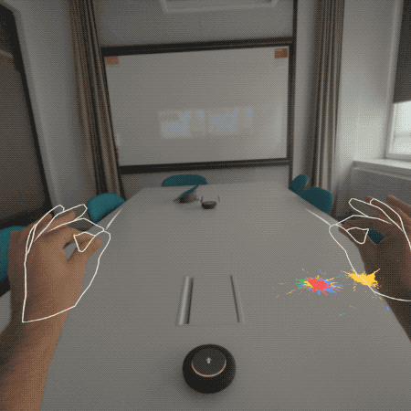
        </a>
        <h3>Paint Splash</h3>
    </td>
    <td align="center" valign="top" width="33%">
        <a href="AndroidXRUnitySamples#sea-through">
            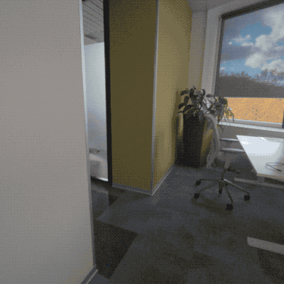
        </a>
        <h3>Sea Through</h3>
    </td>
    <td align="center" valign="top" width="33%">
        <a href="AndroidXRUnitySamples#tape-measure">
            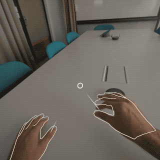
        </a>
        <h3>Tape Measure</h3>
    </td>
  </tr>
  <tr>
    <td align="center" valign="top" width="33%">
        <a href="AndroidXRUnitySamples#tabletop-mess">
            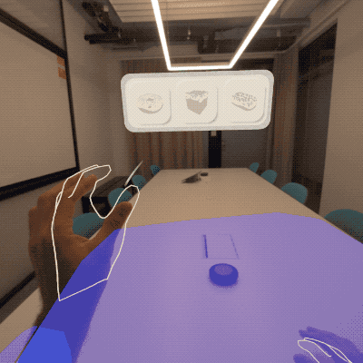
        </a>
        <h3>Tabletop Mess</h3>
    </td>
    <td align="center" valign="top" width="33%">
        <a href="AndroidXRUnitySamples#screen-wiper">
            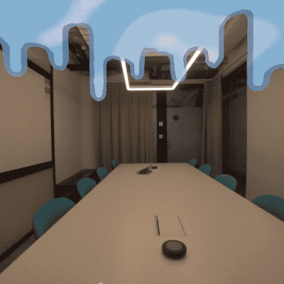
        </a>
        <h3>Screen Wiper</h3>
    </td>
    <td align="center" valign="top" width="33%">
        <a href="AndroidXRUnitySamples#device-detector">
            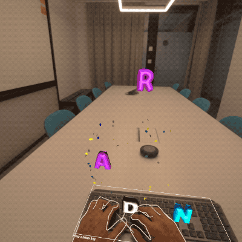
        </a>
        <h3>Device Detector</h3>
    </td>
  </tr>
  <tr>
    <td align="center" valign="top" width="33%">
        <a href="AndroidXRUnitySamples#gaze-and-pinch">
            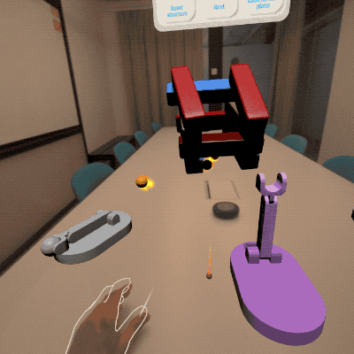
        </a>
        <h3>Gaze and Pinch</h3>
    </td>
    <td align="center" valign="top" width="33%">
        <a href="AndroidXRUnitySamples#creature-gaze">
            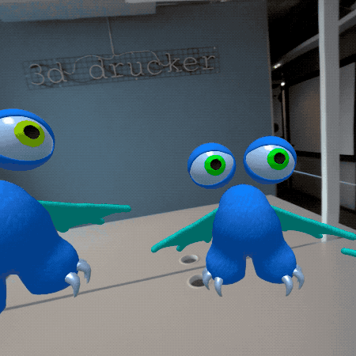
        </a>
        <h3>Creature Gaze</h3>
    </td>
    <td align="center" valign="top" width="33%">
        <a href="AndroidXRUnitySamples#talking-objects">
            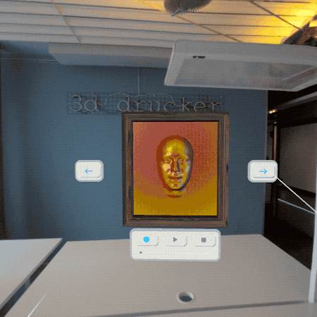
        </a>
        <h3>Talking Objects</h3>
    </td>
  </tr>
  <tr>
    <td align="center" valign="top" width="33%">
        <a href="AndroidXRUnitySamples#marker-maze">
            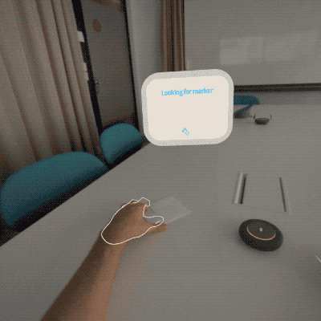
        </a>
        <h3>Marker Maze</h3>
    </td>
    <td align="center" valign="top" width="33%">
        <a href="AndroidXRUnitySamples#surface-canvas">
            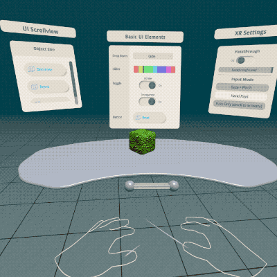
        </a>
        <h3>Surface Canvas</h3>
    </td>
    <td align="center" valign="top" width="33%">
        <a href="AndroidXRUnitySamples#gesture-run">
            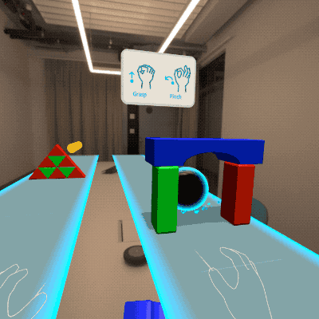
        </a>
        <h3>Gesture Run</h3>
    </td>
  </tr>
  <tr>
    <td align="center" valign="top" width="33%">
        <a href="AndroidXRUnitySamples#sound-arena">
            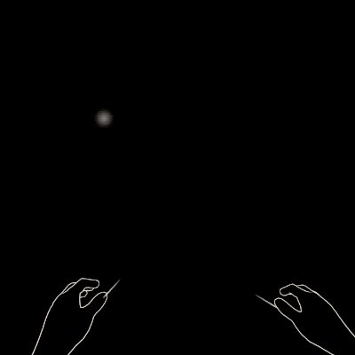
        </a>
        <h3>Sound Arena</h3>
    </td>
    <td align="center" valign="top" width="33%">
        <a href="AndroidXRUnitySamples#avatar-mirror">
            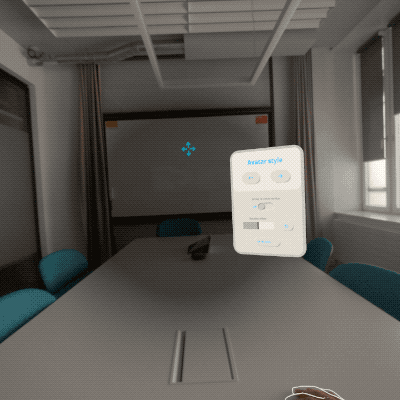
        </a>
        <h3>Avatar Mirror</h3>
    </td>
    <td align="center" valign="top" width="33%">
        <a href="AndroidXRUnitySamples#drone">
            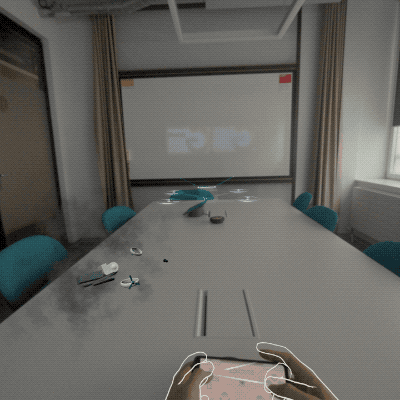
        </a>
        <h3>Drone</h3>
    </td>
  </tr>
  <tr>
    <td align="center" valign="top" width="33%">
        <a href="AndroidXRUnitySamples#gemini">
            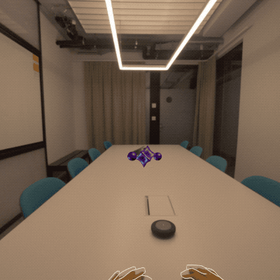
        </a>
        <h3>Gemini</h3>
    </td>
  </tr>
</table>
